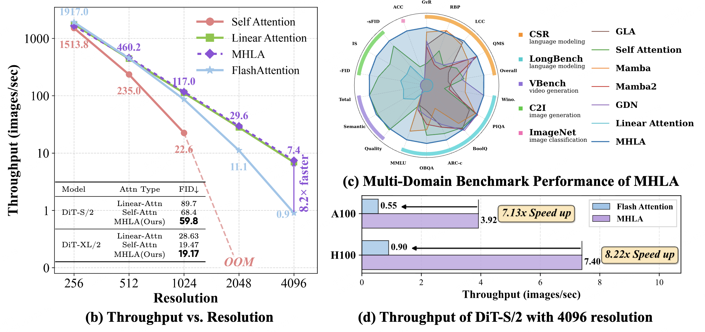
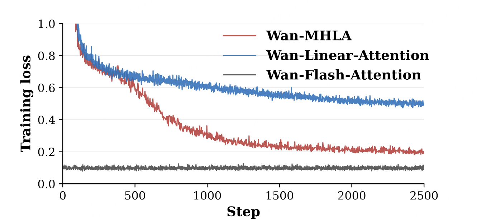

<div align="center">

  
## MHLA: Restoring Expressivity of Linear Attention via Token-Level Multi-Head

<a href="https://arxiv.org/abs/2601.07832"></a> &ensp;
<a href="https://dagroup-pku.github.io/MHLA/"></a> &ensp;
<a href="https://huggingface.co/DAGroup-PKU/MHLA"></a> &ensp;

[Kewei Zhang](https://xiwen1.github.io/)<sup>1*</sup>, 
[Ye Huang](https://yeyeah.life/)<sup>1*</sup>, 
[Yufan Deng](#)<sup>1</sup>, 
[Jincheng Yu](https://github.com/yujincheng08)<sup>2</sup>, 
[Junsong Chen](https://lawrence-cj.github.io/)<sup>2</sup>, <br>
[Huan Ling](https://www.cs.toronto.edu/~linghuan/)<sup>2</sup>, 
[Enze Xie](https://xieenze.github.io/)<sup>2</sup>, 
[Daquan Zhou](https://zhoudaquan.github.io/homepage.io/)<sup>1</sup>


> <sup>1</sup>Peking University  &ensp;  <sup>2</sup>NVIDIA
> 
> ICLR 2026




MHLA is a **universal high-efficiency** linear attention operator. MHLA can be applied to image classification, image generation, language modeling, and video generation tasks, maintaining performance consistent with Flash Attention while achieving significant speed advantages over Flash Attention under long-sequence conditions. For more details, please refer to our [paper](#).

This repository is organized into four sub-projects: [`mhla_dit`](mhla_dit), [`mhla_image_classification`](mhla_image_classification), [`mhla_nlp`](mhla_nlp), and [`mhla_videogen`](mhla_videogen). Each corresponds to the experimental code for the four tasks presented in our paper. Each sub-project contains its own README.md with detailed instructions.


</div>


## 🔥 News
* `[2026.01.26]`  🔥 Our paper is accepted by ICLR 2026!
* `[2026.01.12]`  🔥 Our paper is available at [arxiv](http://arxiv.org/abs/2601.07832).
* `[2026.01.12]`  🔥 We release the code of MHLA, including training and inference code for image classification, image generation, language modeling, and video generation.


## 🎥 Demo
**Please note that the following video is a compressed version. You can view the full HD demo by visiting [this link](https://www.youtube.com/watch?v=up5TX5ssH6A&t=3s).**

https://github.com/user-attachments/assets/25fe11b6-85e8-49a7-8d7d-b56557bb894e


## Todo List
- [x] Release code of MHLA on Video Generation
- [x] Release code of MHLA on DiT
- [x] Release code of MHLA on NLP
- [x] Release code of MHLA on ImageNet classification
- [ ] Release code of MHLA on Sana
- [x] Release pretrained weights of Wan-MHLA
- [ ] Release pretrained weights of DiT-MHLA
- [ ] Release pretrained weights of Sana-MHLA
- [ ] Release pretrained weights of Image Classifcation models with MHLA
- [ ] Release pretrained weights of language models with MHLA

## Installation & Usage

```bash
git clone -b main --single-branch https://github.com/DAGroup-PKU/MHLA
```

Please refer to the README.md files in the following sub-projects for detailed information:
- [mhla_dit](mhla_dit/README.md)
- [mhla_image_classification](mhla_image_classification/README.md)
- [mhla_nlp](mhla_nlp/README.md)
- [mhla_videogen](mhla_videogen/README.md)

## Performance & Efficiency


### On Wan2.1-1.3B

| Method | Quality score | Semantic score | Total | Latency |
| :--- | :---: | :---: | :---: | :---: |
| Wan2.1 1.3B | 85.23 | 75.65 | 83.31 | 139s |
| Full MHLA | 83.93 | 78.40 | 82.83 | 62s |
| Full Linear | 69.96 | 11.38 | 58.24 | 62s |
| MHLA Hybrid 2/3 | 84.87 | 79.59 | 83.82 | 84s |

> Wan-MHLA and Wan-LA replace all layers with MHLA and Linear Attention respectively. Wan-MHLA-H only replace 2/3 layers.

### Excellent Convergence


> As shown in the figure, linear attention fails to converge during training in ultra-long sequence scenarios for video generation, while MHLA demonstrates excellent convergence.


## Acknowledgement

Our project is built on multiple inspiring projects including: [timm](https://github.com/huggingface/pytorch-image-models), [DiT](https://github.com/facebookresearch/DiT), [Sana](https://github.com/NVlabs/Sana) and [flash-linear-attention](https://github.com/fla-org/flash-linear-attention).


## Support Us

If you find this work useful, please consider:
- Starring the repository
- Citing our paper
- Contributing to the codebase


## Citation


```bibtex
@misc{mhla,
      title={MHLA: Restoring Expressivity of Linear Attention via Token-Level Multi-Head}, 
      author={Kewei Zhang and Ye Huang and Yufan Deng and Jincheng Yu and Junsong Chen and Huan Ling and Enze Xie and Daquan Zhou},
      year={2026},
      eprint={2601.07832},
      archivePrefix={arXiv},
      primaryClass={cs.CV},
      url={https://arxiv.org/abs/2601.07832}, 
}
```


